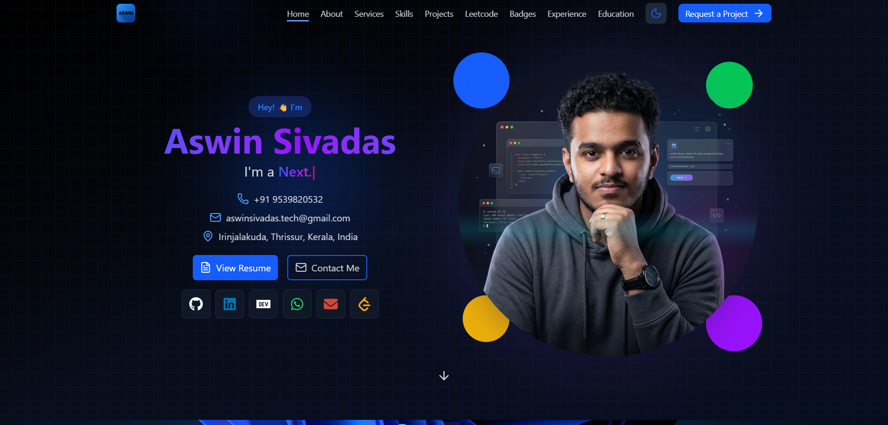

# 🚀 React TypeScript Personal Portfolio

A modern, responsive **personal portfolio website** built using **React + TypeScript** to showcase my projects, skills, and experience.

🔗 **Live Demo:** https://aswinsivadaswebsite.vercel.app/
📂 **Repository:** https://github.com/aswinsivadas-tech/react-ts-personal-portfolio

---

## 📌 Features

* ⚡ Built with **React + TypeScript**
* 🎨 Clean and modern UI
* 📱 Fully responsive design
* ✨ Smooth animations & transitions
* 🧩 Reusable components
* 🌐 SEO-friendly structure
* 🚀 Deployed on Vercel

---

## 🛠️ Tech Stack

* **Frontend:** React, TypeScript
* **Styling:** Tailwind CSS / CSS Modules
* **Animations:** Framer Motion
* **Icons:** Lucide / React Icons
* **Deployment:** Vercel

---

## 📂 Project Structure

```
react-ts-personal-portfolio/
│── public/
│── src/
│   ├── components/
│   ├── sections/
│   ├── assets/
│   ├── styles/
│   ├── App.tsx
│   └── main.tsx
│── package.json
│── tsconfig.json
```

---

## ⚙️ Installation & Setup

Clone the repository and install dependencies:

```bash
git clone https://github.com/aswinsivadas-tech/react-ts-personal-portfolio.git
cd react-ts-personal-portfolio
npm install
```

Run the development server:

```bash
npm run dev
```

Build for production:

```bash
npm run build
```

---

## 🎯 Customization

To customize this portfolio:

* Update your **personal details** in components/sections
* Replace images in the `assets` folder
* Modify colors & styles in Tailwind config / CSS
* Add your own projects and experience

---

## 📸 Screenshots

### 🏠 Home Page

---

## 📬 Contact

* 💼 LinkedIn: https://linkedin.com/in/your-profile
* 📧 Email: [your-email@example.com](mailto:your-email@example.com)
* 🌐 Portfolio: https://your-domain.com

---

## ⭐ Support

If you like this project:

* ⭐ Star the repository
* 🍴 Fork it and customize
* 📢 Share it with others

---

## 📄 License

   ISC

---

